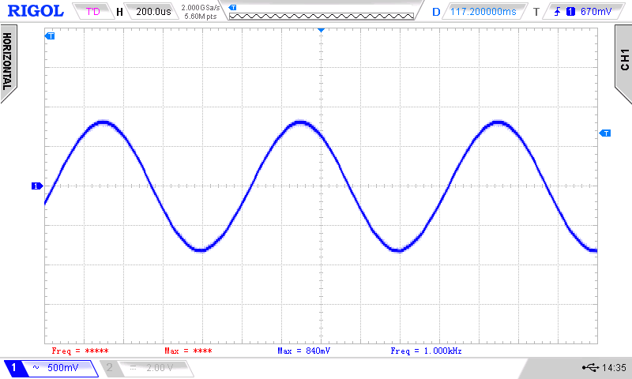

# Direct Digital Synthesis DDS with microcontroller

DDS is a cool thing. To understand how it works is even cooler. So I wrote a little tutorial about DDS (for myself and others :)) . Naturally including software to make it work with an Arduino Uno and a Teensy 4.0.

**The tutorial is here: <http://www.weigu.lu/microcontroller/dds/index.html>**
